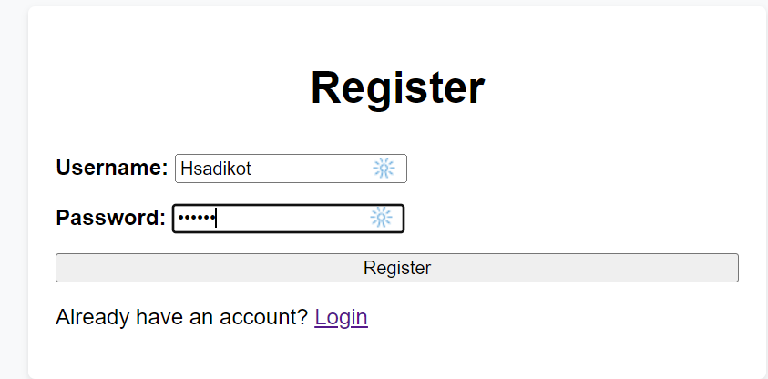

Sure, here's an example of what a `README.md` for your todo list application could look like:

---

# Todo List Application

A simple and interactive todo list application built with Flask and MongoDB. This application allows users to register, login, add, edit, complete, and delete todo tasks. Additionally, users can export their completed tasks to a CSV file. Tasks can also be tagged with an alarm, which sends a reminder when the task's due date arrives.

## Features

- User Registration and Login.
- Add tasks with details like priority level, tags, creation and due date.
- Edit existing tasks.
- Mark tasks as complete.
- Delete tasks.
- View only completed tasks.
- Export completed tasks to CSV.
- Receive reminders on tasks' due date if alarm is set.

## Installation

- Clone the repository.
- Install the dependencies using pip:
    ```
    pip install -r requirements.txt
    ```
- Run the app:
    ```
    python app.py
    ```

## Technologies

- [Flask](https://flask.palletsprojects.com/en/1.1.x/): A micro web framework written in Python.
- [PyMongo](https://pymongo.readthedocs.io/en/stable/): MongoDB driver for Python.
- [Bcrypt](https://pypi.org/project/bcrypt/): Library for password hashing.
- [APScheduler](https://apscheduler.readthedocs.io/en/stable/): Python scheduling library.
- [MongoDB Atlas](https://www.mongodb.com/cloud/atlas): Cloud database service for MongoDB.

## The application is deployed on heroku
<<<<<<< HEAD
https://intense-depths-04125.herokuapp.com/register## The following screenshots show the working of the application
=======
https://vast-sierra-41395.herokuapp.com/
## The following screenshots show the working of the application
>>>>>>> 94d6db534885a130322a37f83965cd0af5695eb9

1. First the user registers for the application

2. Then the users logs in to the app

3. The User will add particular task


4. There is a functionality to add the task, Mark it as complete edit or delete it

5. There is also an functionality to view and export the complete tasks into a csv file


6. No user is allowed to login without registering
7. Duplicate users are not allowed

